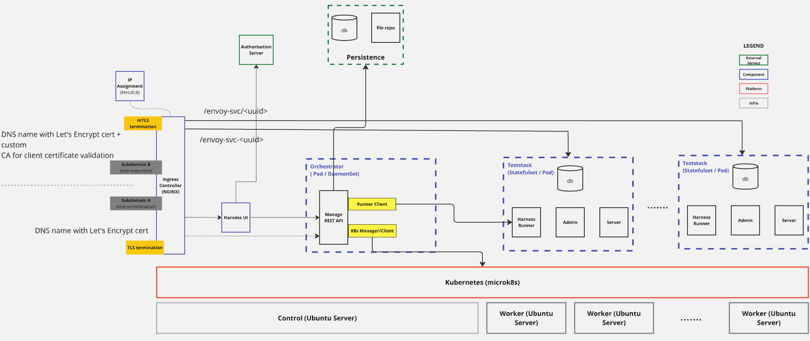

# cactus-deploy: Client Test Platform

This is the primary deployment repository for the client test harness orchestration platform used for cactus (**CSIP-AUS Compliance Testing for Utility Services**).

It contains the Docker images, PKI tooling, and deployment scripts required to build and operate the Cactus platform on a single host using rootful Podman.

## Overview

This project provides:
- Docker images for custom components in the cactus stack, along with associated build workflows.
- IEEE 2030.5 PKI certificate generation tooling.
- Deployment scripts and nginx configuration for a Podman-based single-host deployment.

## Layered Architecture

The diagram below illustrates the layered architecture of the platform. Teststack instances (each a Podman pod containing envoy, cactus-runner, postgres, taskiq-worker, and pubsub) are provisioned on demand by the orchestrator via the Podman API socket. They are served through the `test-execution` domain, which implements mutual TLS and the AES-128-CCM8 cipher suite as required by IEEE 2030.5.



## Directory Structure

```text
cactus-deploy/
├── docker/        # Dockerfiles for cactus components
├── server/        # Deployment scripts, nginx config, and environment template
├── pki/                 # IEEE 2030.5 PKI certificate generation
└── docker/versions.lock # Pinned component versions
```

## Getting Started
Refer to [podman-setup/README.md](./podman-setup/README.md) for detailed steps on setting up the host, generating PKI artefacts, and deploying services.

Key phases include:
- Infrastructure setup: installing Podman, creating the `cactus-net` network, starting Traefik, installing nginx.
- PKI creation: generating the SERCA/MCA/MICA certificate chain.
- Database setup: creating the external PostgreSQL instance and running Alembic migrations.
- Container deployment: running `update.sh` to start orchestrator, UI, and notifications containers.

**Prerequisites**
- Ubuntu 24.04
- Root access
- External PostgreSQL instance accessible from this host
- nginx with AES-128-CCM8 OpenSSL support (see podman-setup/README.md)

## Security Notes
- Scripts and manifests assume hardened Linux systems. Apply baseline OS hardening before deployment.
- Secrets for TLS and application credentials must be securely managed and rotated as required.

## Platform Versioning
Versioning of the platform components is tracked centrally. Each tag in this repository (e.g., release-1, release-2) corresponds to a stable combination of component versions.

Versions of the components used in any given build are defined in [versions.lock](./docker/versions.lock).
