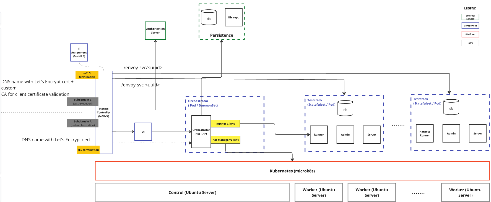

# cactus-deploy: Client Test Platform

This is the primary deployment repository for the client test harness orchestration platform used for cactus (**CSIP-AUS Compliance Testing for Utility Services**).

It contains the configuration, scripts, and manifest templates required to build and operate a MicroK8s-based Kubernetes cluster that supports the cactus Client Test Harness and associated services.

## Overview

This project provides:
- Docker images for custom components in the cactus stack, along with associated build workflows.
- Instructions for bootstrapping and securing a MicroK8s cluster.
- Kubernetes manifest templates and configuration tooling.

## Layered Architecture

The diagram below illustrates the layered architecture of the platform. Teststack instances (comprising a Kubernetes Service and StatefulSet) are provisioned on demand via the orchestrator interface, which is exposed through the `test-orchestration` domain. These instances serve as self-contained test environments for clients to test against a CSIP-AUS compliant utility server. The utility server is exposed back to the client via the `test-execution` domain, which implements mutual TLS as required by the communication standard.



## Directory Structure

```text
cactus-deploy/
├── docker/              # Dockerfiles for cactus components
├── k8s-cluster/         # Main deployment logic and manifests
│   ├── deploy-template/     # Template manifests with environment variable placeholders
│   ├── cluster-setup/       # Scripts and manifests for cluster configuration
│   ├── ingress/             # Ingress and certificate setup
│   └── app-setup/           # Application-specific resources
├── README.md
└── VERSIONS.md

## Getting Started
Refer to [k8s-cluster/README.md](./k8s-cluster/README.md) for detailed steps on setting up the cluster, preparing manifests and deploying services.

Key phases include:
- Cluster Creation: Installing and configuring MicroK8s on all nodes.
- Manifests Preparation: Using environment variables to generate Kubernetes resources.
- Cluster Configuration: Setting up namespaces, ingress encryption, and secrets.
- App Deployment: Creating core orchestrator and test stack template resources.

**Prerequisites**
- Ubuntu 24.04 nodes
- MicroK8s on all nodes
- envsubst utility on head node 
- Admin access on all nodes

## Security Notes
- Scripts and manifests assume hardened Linux systems. Apply baseline OS hardening before deployment.
- Secrets for TLS and application credentials must be securely managed and rotated as required.

## Platform Versioning
Versioning of the platform components is tracked centrally. Each tag in this repository (e.g., release-1, release-2) corresponds to a stable combination of component versions.

See [VERSIONS.md](./VERSIONS.md) for the full version history of component releases.